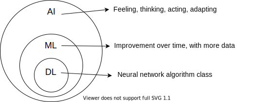

- Fei Fei Li: mass image labeling.

- Problem in labeling: relationship between image and substantive.

- Deep Learning: evolution of Machine Learning which depends on mass labeling.

- Inferential model.

- ImageNet: AI contest promotes Deep Learning.

  - 2012, AlexNet wins ImageNet.
  - Already structured over Convolutional Neural Network.
  - Fei Fei Li: problematic results in face of biased labels.

- Hard to understand or reverse-engineer a result.

- Al-Gahaku: painting from photo generation.

- AI conceptually: automation of cognitive tasks.

- Related or synonymous: computer vision, natural language processing, robotics.

- Starts from sensors and actuators (environment interaction).

  - Distinction from a program: non-static feedback mechanism.

- Use, simulating human intelligence

  - New use, complementing human intelligence

- An AI system does only one task, unlike our brains.

- Automaton vs. autonomous: decision tree vs. self-learning

- Perceptual sequencing: stored data is learning. Could be stored, but erased in a simpler mechanism.

  

- "Deep": algorithms working with processing layers
- Lev Manovich, 2018 book about A.I.
- Alien: Isolation game.
- AI initially about cognition automation and progressively about scaling it, with incentive of applications.
- Improving = optimization (CS or Mathematics concepts)
- Parameter value combination forms a vector, labeling. Vectors form multi-dimensional matrices. Regression is made to compare to labels.
- ML: input, output, and algorithm, generally a regression.
- Transfer learning: using existing learning.
- Teachable Machine: classes are labels.