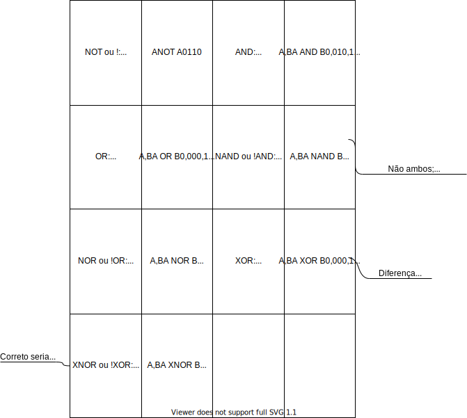

### Álgebra Booleana

https://www.electronics-tutorials.ws/boolean

Simplificar expressão booleana para reduzir o número de portas lógicas.

Porta lógica: operação lógica em uma ou mais entradas binárias, produzindo uma única saída binária.

Leibniz: usando um sistema numérico binário, princípios de aritmética e lógica poderiam ser combinados.

Tabela-verdade de 16 linhas introduzida por Wittgenstein no Tractatus (1921).

Engenharia elétrica: NEC, Akira Nakashima com álgebra booleana de dois valores representando a comutação de circuitos (switching circuit).

Claude E. Shannon expandiu o uso da álgebra booleana para desenho e análise de circuitos comutativos em 1937.

Conceito fundamental dos computadores. Fundação do design de circuitos digitais.

As leis de Boole podem ser usadas para provar expressões booleanas ou simplificar *circuitos digitais complexos*. [1]

$\text{OR}$ e $\text{AND}$ representados como $+$ e $\cdot$. $A+B=A\text{ OR }B$ e $A\cdot B=A\text{ AND }B$.
