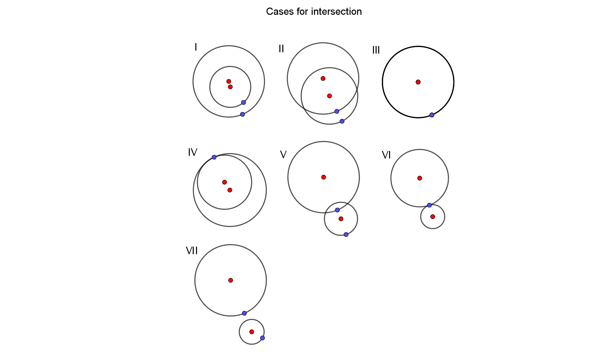
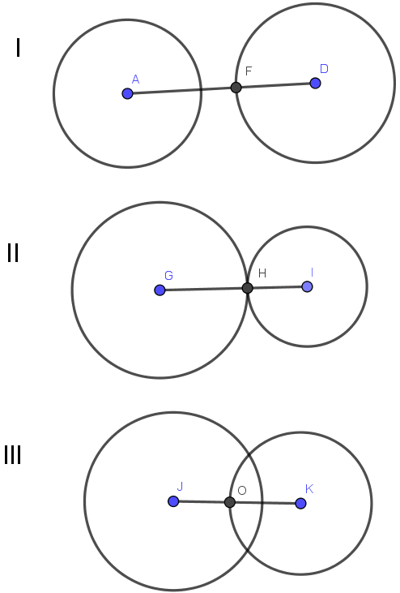
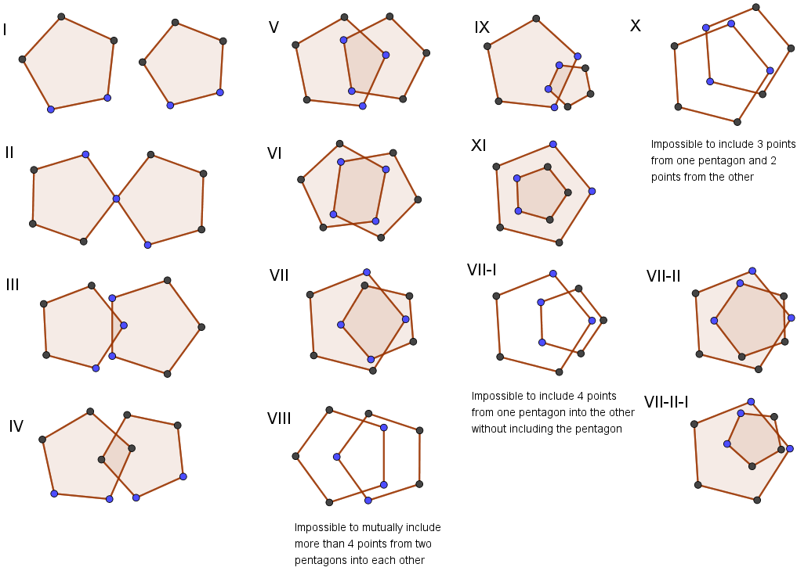
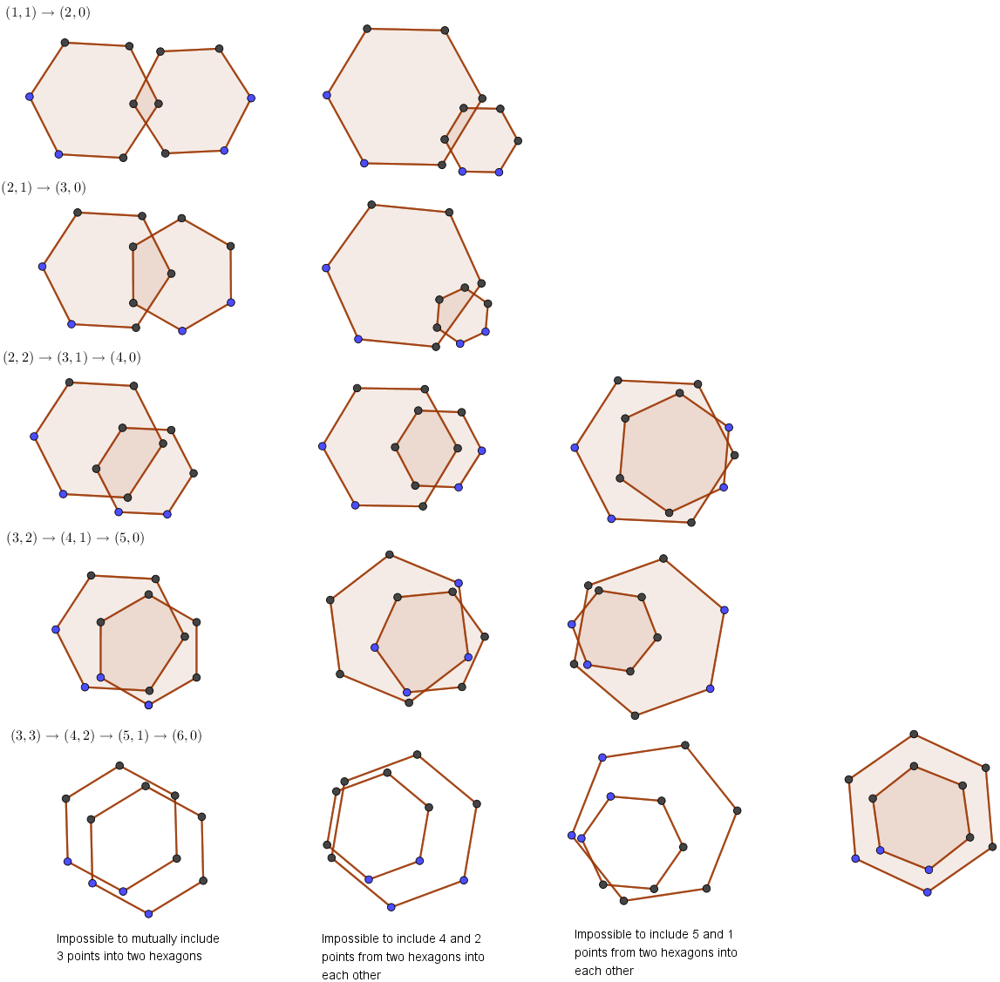

# Irrationality of $\sqrt{2}$

> Is the length of the diagonal whose side is $\large{1}$ expressible as a ratio of two integers? [1], p. 6

This side's length is $\large{\sqrt{2}}$ because of the Pythagorean theorem:
$$
\large{a^2=1^2+2^2}
$$

> In other words, do there exist two integers $\large{a,b}$ with no divisor in common such that $\large{(a/b)}^2=2$?

"No divisor in common": an integer would defeat the thesis of irrationality as well, but we're looking specifically for a rational.

Let's try to give geometric interpretations of the square of $\large{\dfrac{a}{b}}$ equaling a number.

$$
\large{
\left(\dfrac{a}{b}\right)^2=2\Rightarrow\\
\dfrac{a^2}{b^2}=2\Rightarrow\\
a^2=2b^2
}
$$
$\large{2b^2}$ is even, because the definition of evenness is divisibility by $\large{2}$, or equivalently, being a multiple of $\large{2}$, which $\large{2b^2}$ clearly is.

The square of an odd integer being odd necessitates defining "squaring" geometrically.

Squaring is multiplying a number by itself. Geometrically, translating a number into a new dimension creates a new number which is one higher power of the number.

- Opening a height of $\large{3}$ from a width of $\large{3}$ produces an ***area*** of $\large{3\times 3}$, from power $\large{1}$ to $\large{2}$.
- Opening a depth of $\large{3}$ from a height and width both of $\large{3}$ produces a ***volume*** of $\large{3\times 3\times 3}$, or power from $\large{2}$ to $\large{3}$.

We are concerned with the power $\large{2}$.

But how do we open such new dimension for a number $\large{n}$ geometrically?

1. Given a segment of length $\large{n}$;
2. Draw a perpendicular line, that is, forming a right angle, from one of its end points;
3. Intersect the perpendicular line with the arc from the other end point.

Procedural construction of this scene is done in `Irrationality_of_Square_Root_of_Two.nb`.

Object oriented construction is done in the package `pslab.geom` in `PSLab`.

## Intersection of circles A and B?

Given two circles with specified center and radius, what is their intersection?

Where:

- $\large{\alpha\in\mathbb{R}}$ is the distance between the centers
- $\large{\beta\gt 0\in\mathbb{R}}$ is the radius
- $\large{\alpha, \beta\in\mathbb{R}}$,

Then:

- If $\large{\alpha =0}$ (concentric), the circles' intersection is the circle (they're the same) (==case Ⅲ==)
- If $\large{\alpha=2\,\beta}$ (for example $\large{\mid AI\mid}$), the circles' intersection is one point (in this case, $\large{J}$) (==case Ⅵ==)
- If $\large{0\lt \alpha \lt 2\,\beta}$ (for example $\large{\mid AF\mid}$), the circles' intersection is two points (in this case, $\large{\left\{L,K\right\}}$) (==case  Ⅱ==)
- If $\large{\alpha\gt 2\,\beta}$ (for example $\large{\mid AG\mid}$), the circles' intersection is null (==case Ⅶ==)
- In this scenario, once circle can't contain another

### Distinct radius circles

Let's define a circle from two points, for center and radius point, plus a measure $\large{\alpha}$ of revolution of $\large{r}$ around $\large{c}$, measured from $\large{0}$ (where the circle reduces to a segment) to $\large{1}$ (one full revolution). So, a record $\large{\left\{c,r,\alpha\right\}}$, where:

- $\large{c}$ - the center point
- $\large{r}$ - the radius point
- $\large{\alpha}$ - the revolution, from $\large{0}$ to $\large{1}$

How to decide intersection of two circles in this form?

Let's define the following variables and map out the same cases.

- $\large{\text{DBC}}$: the distance between centers
- $\large{\text{DBR}}$: the difference between radiuses (subtraction in absolute)
- $\large{\text{SOR}}$: the sum of radiuses

Each case for the values $\large{\text{DBC}-\text{SOR}}$, $\large{\text{DBR}-\text{DBC}}$ above is exclusive. This defines the following table.

|                                                              | $\large{\text{DBC}-\text{SOR}\lt 0\Leftrightarrow\text{DBC}\lt\text{SOR}}$ | $\large{\text{DBC}-\text{SOR}=0\Leftrightarrow\text{DBC}=\text{SOR}}$ | $\large{\text{DBC}-\text{SOR}\gt 0\Leftrightarrow\text{DBC}\gt\text{SOR}}$ |
| ------------------------------------------------------------ | ------------------------------------------------------------ | ------------------------------------------------------------ | ------------------------------------------------------------ |
| $\large{\text{DBR}-\text{DBC}\lt 0\Leftrightarrow\text{DBR}\lt\text{DBC}}$ | $\large{\text{DBR}\lt\text{DBC}\lt\text{SOR}}$ Circle in proper complement; null intersection | $\large{\text{DBR}\lt\text{DBC}\,\land\,\text{DBR}\lt\text{SOR}}$ Circle in improper complement; point intersection | $\large{\text{DBR}\lt\text{DBC}\,\land\,\text{SOR}\lt\text{DBC}}$ Not contained or in complement; pair of points intersection |
| $\large{\text{DBR}-\text{DBC}=0\Leftrightarrow\text{DBR}=\text{DBC}}$ | $\large{\text{DBR}\lt\text{SOR}\,\land\,\text{DBC}\lt\text{SOR}}$ Circle improperly contained; point intersection | $\large{\text{DBR}=\text{DBC}=\text{SOR}}$                   |                                                              |
| $\large{\text{DBR}-\text{DBC}\gt 0\Leftrightarrow\text{DBR}\gt\text{DBC}}$ |                                                              |                                                              | $\large{\text{SOR}\lt\text{DBC}\lt\text{DBR}}$ Circle properly contained; null intersection |

The missing cases didn't appear in our visual analysis. Let's analyze in more detail each of our variables and their relations.

- **DBC**
  - If **DBC** is zero, the circles are concentric
  - Otherwise, **DBC** must be positive
- **SOR**
  - If **SOR** is zero, both circles are points; this is not permitted
  - **SOR** is positive
- **DBR**
  - **DBR** is taken to be in absolute; so it either is zero or positive
  - If **DBR** is zero, the circles' radiuses are equal
- **DBC** and **SOR**
  - If the **DBC** equals **SOR**, we know the circles intersect in one point
  - If **DBC** is larger than **SOR**, there is a gap between the circles, or the circles are in each other's complement
  - If **DBC** is smaller than **SOR**, there is a negative gap between the circles, meaning the circles are **not** in each other's complements.
- **DBR** and **DBC**
  - ==The relationship between **DBR** and **DBC** seems (if any) unclear. We can't be positive $\large{\text{DBR}-\text{DBC}}$ is relevant to the result, or that it is not a coincidence.==

### Geometrically

The above inferences use numbers and the order relation. What can be observed geometrically?

- If two circles have one point of intersection, then their centers must be collinear with the point of intersection.
  - Collinear centers and intersection algorithm
    1. Draw a segment between the two circles' centers
    2. Intersect one of the circles with this segment
    3. If the point of intersection is in the complement of the other circle, then the intersection is null (==case Ⅰ== below)
    4. If the point of intersection is in the other circle itself, then the intersection is that point (==case Ⅱ== below)
    5. Else (the point is in the interior of the circle), the intersection is a pair of points (==case Ⅲ== below)

This algorithm necessitates identifying a point being on a circle vs. it being on the interior of it.

We want to avoid using numbers, so we must avoid using arbitrary Euclidean distances. We could try defining a point as being in the **interior** of a circle as that which is in a circle the intersection of which with the first circle results in a segment, instead of a point.

This way, we define interactions between objects as generating new objects, and evaluate the generated objects.

Let's evaluate the same kind of interaction definition for another case of regular polygon, the pentagon.

There is an algorithm being followed in this construction. The algorithm is that with each step, we include one more point from one polygon into the other, symmetrically, that is, alternating from which polygon is the point included (ignoring step Ⅱ for now).

Some observations.

- The polygon formed by the inclusion has $\large{n+2}$ sides, where $\large{}n$ is how many points are included in the intersection (from whichever pentagon).
  - ==VII-II== is an exception: 3 points in the intersection, 7 sides
    - ==VII-II== is different from ==V== in that there are 3 points from one pentagon and 0 from the other, while ==V== has 2 from one and 1 from the other; that is, the difference between number of points included from each pentagon, or inclusion asymmetry (what's both subtracted from one and added to the other), is 1 greater
    - This ($\large{(2,1)\rightarrow(3,0)}$) is the first increase in inclusion asymmetry that's meaningful, where meaningful means the resulting intersection polygon has a different number of sides

Let's list the inclusion asymmetry chains for pentagons.

- $\large{(1,1)\rightarrow(2,0)}$: $\large{4\rightarrow 4}$ sides
- $\large{\color{blue}{(2,1)\rightarrow(3,0)}}$: $\large{\color{blue}{5\rightarrow 7}}$ sides
- $\large{(2,2)\rightarrow(3,1)\rightarrow(4,0)}$: $\large{6\rightarrow 6\rightarrow 6}$ sides
- $\large{(5,0)}$: $\large{5}$ sides ==(proper inclusion)==

The max inclusion asymmetry chain for a polygon of 5 sides is the chain with sum of included sides 4.

The $\large{(1,0)}$ inclusion, obviously symmetric, has always 3 sides.

Let's look at polygons with more sides.

##### Hexagon

- Chains from pentagon
  - $\large{(1,1)\rightarrow(2,0)}$: $\large{4\rightarrow 4}$ sides
  - $\large{(2,1)\rightarrow(3,0)}$: $\large{5\rightarrow 5}$ sides
  - $\large{(2,2)\rightarrow\color{blue}{(3,1)\rarr(4,0)}}$: $\large{6\rightarrow \color{blue}{6\rarr 8}}$ sides
- $\large{(3,2)\rightarrow(4,1)\rightarrow(5,0)}$: $\large{7\rarr 7\rarr 7}$ sides
- $\large{(6,0)}$: $\large{6}$ sides ==(proper inclusion)==

Once again, the max (improper) chain is of size $\large{\text{sides}-1}$.

##### Polygons with more sides

- $\large{(4,3)\rightarrow(5,2)\rightarrow(6,1)\rightarrow(7,0)}$: ==?==
- $\large{(4,4)\rightarrow(5,3)\rightarrow(6,2)\rightarrow(7,1)\rightarrow(8,0)}$: ==?==
- $\large{(5,4)\rightarrow(6,3)\rightarrow(7,2)\rightarrow(8,1)\rightarrow(9,0)}$: ==?==

### Pattern

Let's try to identify a pattern of intersection for regular polygons.

##### Definitions

- An intersection is sized by the count of vertices included from each polygon into the other polygon
- A side is an edge joining two vertices
- A vertex is included in a polygon if its two sides are either properly of improperly included in the polygon
- A side is properly included in a polygon if both its vertices are included in the polygon
  - A side is improperly included in a polygon if one of its vertices is included in the polygon and the other is not
  - A side is not included in a polygon if its two vertices are not included in the polygon

##### Axioms for regular polygons

- Let's define a $\large{\lt}$ binary order relation between regular polygons of same number of sides
- Let's refer to $\large{A}$ and $\large{B}$ as regular polygons involved in an intersection

##### More definitions

- An intersection has some global properties
  - In an intersection, sides from $\large{A}$ and $\large{B}$ cut each other
  - A side from one polygon may be cut by any number of sides from the other polygon
- ~~Let's define an "ideal" intersection.~~
  - ~~An ideal intersection is one on which~~
    - ~~A side from $\large{A}$ is cut by one side from $\large{B}$ in its half point only~~
    - ~~A side from $\large{A}$ is cut by two sides from $\large{B}$ is its $\large{1/4}$ and $\large{3/4}$ points only~~
    - ~~==This definition uses numbers and will need to be revised in terms of other points later on==~~
    - This definition is dead wrong.

##### Intersections based on collinearities (to do)

## References

1. Mathematics and Logic, Mark Cac and Stanislaw Ulam, Dover Publications, 1968