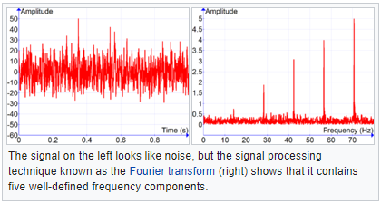

### Música

Livro 1: a fundamental é ditada pela frequência, que é exatamente a frequência da onda seno ou quantas vezes repete em um espaço de tempo.

- Os harmônicos são novas ondas somadas

- Os harmônicos são o **timbre**

- A dúvida é na passagem:

  > (Harmonic summing) Only works with sine waves because they are the only type of sound that has no harmonics of its own.

  - Vibração de copo de vidro tem onda quase senoidal pura

E outras funções contínuas? O quê numa função seno diferenciaria de uma outra contínua periódica?

- Por exemplo, uma função contínua não diferenciável, como uma step function?

Analisador de espectro. Parece ser o mesmo que Periodograma

- Plota a fundamental e harmônicos em um "som"
- Mas o que é um "som"?
- Os harmônicos estão dispostos em "série harmônica"
- Fast Fourier Transform spectrum analyzer
  - Discrete e continuous "transforms" do "sinal"
- O espectrograma do Reaper mostra as frequências em cada momento
  - A pergunta é: um sample de áudio tem $\large{n}$ frequências?
    - Não, Voxengo Scan: "block size"... tamanho do bloco a usar para calcular
      - "Fourier block size in samples"
  - Voxengo Scan: escala logarítmica... 4 notas em intervalo igual têm distância igual

Campo: processamento de sinais.

Transdução é a conversão de sinais de onda **para** sinais de onda elétricos.

Sinais de onda elétricos podem ser transmitidos como **ondas eletromagnéticas**.

Sinal: amplitude $\times$ tempo.

Fourier Transform: frequência $\times$ amplitude.

O Fourier Transform decompõe um sinal em $\large{n}$ ondas sinusoidais. A apresentação visual exibe a amplitude da onda de cada frequência.

> Um periodograma é como uma Fourier Transform, mas otimizado para dados amostrados irregularmente e para diferentes "formatos" de sinais periódicos. [1]

# Referências

1. http://coolwiki.ipac.caltech.edu/index.php/What_is_a_periodogram%3F