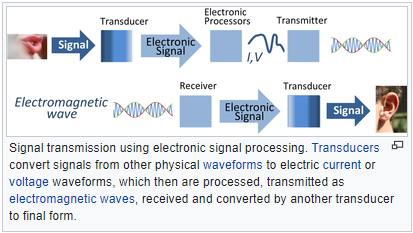
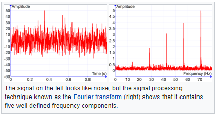

### Som

Livro 1: a fundamental é ditada pela frequência, que é exatamente a frequência da onda seno ou quantas vezes repete em um espaço de tempo.

- Os harmônicos são novas ondas somadas

- Os harmônicos são o **timbre**

- A dúvida é na passagem:

  > (Harmonic summing) Only works with sine waves because they are the only type of sound that has no harmonics of its own.

  - Vibração de copo de vidro tem onda quase senoidal pura

E outras funções contínuas? O quê numa função seno diferenciaria de uma outra contínua periódica?

- Por exemplo, uma função contínua não diferenciável, como uma step function?

Analisador de espectro. Parece ser o mesmo que Periodograma

- Plota a fundamental e harmônicos em um "som"
- Mas o que é um "som"?
- Os harmônicos estão dispostos em "série harmônica"
- Fast Fourier Transform spectrum analyzer
  - Discrete e continuous "transforms" do "sinal"
- O espectrograma do Reaper mostra as frequências em cada momento
  - A pergunta é: um sample de áudio tem $\large{n}$ frequências?
    - Não, Voxengo Scan: "block size"... tamanho do bloco a usar para calcular
      - "Fourier block size in samples"
  - Voxengo Scan: escala logarítmica... 4 notas em intervalo igual têm distância igual

Campo: processamento de sinais.

Transdução é a conversão de sinais de onda **para** sinais de onda elétricos.

Sinais de onda elétricos podem ser transmitidos como **ondas eletromagnéticas**.

Sinal: amplitude $\times$ tempo.

Fourier Transform: frequência $\times$ amplitude.

O Fourier Transform decompõe um sinal em $\large{n}$ ondas sinusoidais. A apresentação visual exibe a amplitude da onda de cada frequência.

> Um periodograma é como uma Fourier Transform, mas otimizado para dados amostrados irregularmente e para diferentes "formatos" de sinais periódicos. [1]

Teoria dos campos. Dois campos envolvidos em uma onda. Onda mecânica: campo estresse e campo tensão em oscilação em torno de um equilíbrio. A tensão causa estresse local que causa tensão em partículas vizinhas, **propagando** a onda em um meio físico. Ondas de som, tensão como pressão sonora e propagação por partículas de ar.

Uma onda eletromagnética (por exemplo, a luz) é composta pelos campos elétrico e magnético com propagação via troca energética entre estes campos.

Teoricamente, uma onda é caracterizada como a alteração periódica do equilíbrio das quantidades representadas pelos campos, simbolizada em uma equação.

---

\[2\]:

The principles of signal processing can be found in the classical numerical analysis techniques of the 17th century. They further state that the digital refinement of these techniques can be found in the digital control systems of the 1940s and 1950s.

The concept of discrete-time signal processing also refers to a theoretical discipline that establishes a mathematical basis for digital signal processing, without taking quantization error into consideration.

\[3\]:

Since the invention of calculus in the 17th century, scientists and engineers have developed models to represent physical phenomena in terms of functions of continuous variables and differential equations. Numerical techniques have been used to solve these equations when analytical solutions are not possible. Indeed, Newton used finite-difference methods that are special cases of some discrete-time systems. Mathematicians of the 18th century, such as Euler, Bernoulli, and Lagrange, developed methods for numerical integration and interpolation of functions of a continuous variable. Gauss discovered the principle of the fast Fourier transform as early as 1805 &mdash; even before the publication of Fourier's treatise on harmonic series representation of functions.

Another important implication of the fast Fourier transform algorithm was that it was an inherently discrete-time concept. It was directed toward the computation of the Fourier transform of a discrete-time signal or sequence and involved a set of properties and mathematics that was exact in the discrete-time domain &mdash; it was not simply an approximation to a continuous-time Fourier transform. This had the effect of stimulating a reformulation of many signal processing ceoncepts and algorithms in terms of discrete-time mathematics, and these techniques then formed an exact set of relationships in the discrete-time domain. Following this shift away from the notion that signal processing on a digital computer was merely an approximation to analog signal processing techniques, there emerged a strong interest in discrete-time signal processing as an important field of investigation in its own right.

Some waves have envelopes which do not move at all such as standing waves (which are fundamental to music). [4] A standing wave is a wave which oscillates in time but whose peak amplitude profile does not move in space. The peak amplitude of the wave oscillations at any point in space is constant with time, and the oscillations at different points throughout the wave are in phase. [5]

\[4\]:

A wave can be described just like a field, namely as a function $\large{F(x,t)}$ where $\large{x}$ is a position and $\large{t}$ is a time. The value of $\large{F(x,t)}$ can be any physical quantity of interest assigned to the point $\large{x}$ that may vary with time. For example, if $\large{F}$ represents the vibrations inside an elastic solid, the value of $\large{F(x,t)}$ is usually a vector that gives the current displacement from $\large{x}$ of the material particles that would be at the point $\large{x}$ in the absence of vibration. For an electromagnetic wave, the value of $\large{F}$ can be the *electric field vector* $\large{E}$, or the *magnetic field vector* $\large{H}$, or any related quantity, such as the Poynting vector $\large{E\times H}$. In fluid dynamics, the value of $\large{F(x,t)}$ could be the velocity vector of the fluid at point $\large{x}$, or any scalar property like pressure, temperature, of density. In a chemical reaction, $\large{F(x,t)}$ could be the concentration of some substance in the neighborhood of point $\large{x}$ of the reaction medium.

An electromagnetic wave consists of two waves that are oscillations of the electric and magnetic fields. An electromagnetic wave travels in a direction that is at right angles to the oscillation direction of both fields. In the 19th century, James Clerk Maxwell showed that, in vacuum, the electric and magnetic fields satisfy the wave equation both with speed equal to that of the speed of light. From this emerged the idea that light is an electromagnetic wave. Electromagnetic waves can have different frequencies (and thus wavelengths), giving rise to various types of radiation such as radio waves, microwaves, infrared, visible light, ultraviolet, X-rays and Gamma rays.

A physical wave is almost always confined to some finite region of space, called its domain. For example, the seismic waves generated by earthquakes are significant only in the interior and surface of the planet, so they can be ignored outside of it. However, waves with infinite domain are commonly studied in mathematics, and are very valuable tools for understanding physical waves in finite domains.

A plane wave is an important mathematical idealization where the disturbance is identical along any (infinite) plane normal to a specific direction of travel. Mathematically, the simples wave is a sinusoidal plane wave in which at any point the field experiences simple harmonic motion at one frequency. In **linear media** (==i.e. media can be linear or curvilineous?==), complicated waves can generally be decomposed as the sum of many sinsuidal plane waves having different directions of propagation and/or different frequencies. A plane wave is classified as a **transverse** wave if the field disturbance at each point is described by a vector perpendicular to the direction of propagation (also the direction of energy transfer); or **longitudinal** if those vectors are exactly in the propagation direction. **Mechanical** waves include both transverse and **longitudinal** waves; electromagnetic waves are strictly **transverse** while **sound** waves in fluids (such as air) can only be **longitudinal**. The physical direction of an oscillating field relative to the propagation direction is also referred to as the wave's **polarization** which can be an important attribute for waves having more than one possible polarization.

---

# Referências

1. http://coolwiki.ipac.caltech.edu/index.php/What_is_a_periodogram%3F
2. https://en.wikipedia.org/wiki/Signal_processing#cite_note-3
3. Oppenheim, Schafer, Buck, Discrete-Time Signal Processing, Prentice Hall, 1989.
4. https://en.wikipedia.org/wiki/Wave
5. https://en.wikipedia.org/wiki/Standing_wave