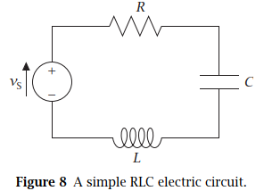

The Princeton Companion to Applied Mathematics, Nicholas J. Higham, Princeton University Press, 2015.

Second-order ODEs also arise in electrical networks. Consider the flow of electric current $\large{I(t)}$ in a simple RLC circuit composed of an inductor with inductance $\large{L}$, a resistor with resistance $\large{R}$, a capacitor with capacitance $\large{C}$, and a source with voltage $\large{v_s}$, as illustrated in figure 8.

The Kirchhoff voltage law states that the sum of the voltage drops around the circuit equals the input voltage, $\large{v_2}$. The voltage drops across the resistor, inductor, and capacitor are $\large{RI}$, $\large{L\dfrac{\mathop{dI}}{\mathop{dt}}}$, and $\large{\dfrac{Q}{C}}$, respectively, where $\large{Q(t)}$ is the charge on the capacitor, so 
$$
\large{L\dfrac{\mathop{dI}}{\mathop{dt}}+RI+\dfrac{Q}{C}=v_s(t)\text{.}}
$$
Since $\large{I=\dfrac{\mathop{dQ}}{\mathop{dt}}}$, this equation can be rewritten as the second-order ODE 
$$
\large{L\dfrac{\mathop{d^2Q}}{\mathop{dt^2}}+R\dfrac{\mathop{dQ}}{\mathop{dt}}+\dfrac{1}{C}Q=v_s(t)\text{.}}
$$