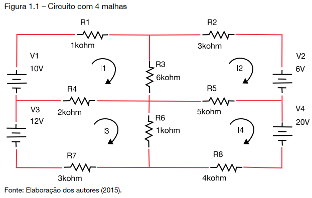

Noções de Álgebra Linear, Salles e Wagner, Unisul Virtual, 2016.

Sistemas lineares também podem descrever o fluxo de corrente elétrica em um circuito elétrico. Uma bateria é um tipo de gerador de voltagem que faz com que uma corrente de elétrons percorra o circuito.

Existe uma lei, chamada Lei de Ohm, que relaciona a voltagem $\large{V}$ (medida em volts), a resistência $\large{R}$ (medida em ohms) e o fluxo de corrente $\large{I}$ (medido em amperes):
$$
\Large{V=R\times I}
$$
Observe o circuito da figura a seguir, que contém quatro malhas.

Vamos denotar por:

- $\large{I_n}$ a corrente da malha $\large{n}$;
- $\large{V_n}$ a voltagem da malha $\large{n}$;
- $\large{R_1,\ldots,R_8}$ e $\large{I_3}$ e $\large{I_4}$ as resistências descritas nas malhas do circuito.

Sabendo que as direções atribuídas a cada uma dessas correntes são dadas conforme a figura, se uma corrent aparece com valor negativo, então sua direção real é a inversa da estipulada na figura.

A soma algébrica das quedas de voltagem $\large{RI}$ em torno de uma malha é igual à soma algébrica das fontes de voltagem na mesma direção nessa malha.

Para determinar a corrente em cada malha, vamos realizar os somatórios das tensões e aplicar a lei de Kirchhoff (o somatório das tensões em um circuito fechada deve ser igual a zero, pois o ponto inicial seria o mesmo ponto final).

Podemos deduzir o seguinte sistema:
$$
\Large{\begin{cases}
(R_1+R_3+R_4)\times I_1-R_3\times I_2-R_4\times I_3=V_1\text{ (malha 1)}\\
-R_3\times I_1+(R_2+R_3+R_5)\times I_2-R_5\times I_4=-V_2\text{ (malha 2)}\\
-R_4\times I_1+(R_4+R_6+R_7)\times I_3-R_6\times I_4=V_3\text{ (malha 3)}\\
-R_5\times I_2-R_6\times I_3+(R_5+R_6+R_8)\times I_4=-V_4\text{ (malha 4)}
\end{cases}}
$$
Como a figura informa os valores das resistências e das voltagens, o sistema se escreve como:
$$
\Large{\begin{cases}
9\times I_1-6\times I_2-2\times I_3=10\\
-6\times I_1+14\times I_2-5\times I_4=-6\\
-2\times I_1+6\times I_3-1\times I_4=12\\
-5\times I_2-1\times I_3+10\times I_4=-20
\end{cases}}
$$
Cuja solução é:

$\large{I_1=1.0464}$ ampéres

$\large{I_2=-0.7590}$ ampéres

$\large{I_3=1.9853}$ ampéres

$\large{I_4=1-2.1810}$ ampéres