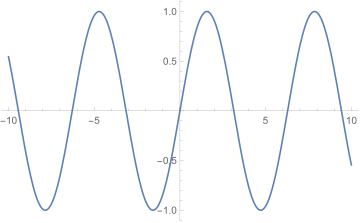

#### Questão 3

Seja $f:\left[a,b\right]\rightarrow\mathbb{R}$ contínua. Se $f$ é derivável em $(a,b)$, então existe um ponto $c \in (a,b)$ tal que $f'(c)=\dfrac{f(b)-f(a)}{b-a}$.

1. Seja $f(x)=sen(x)$. Pelo Teorema do Valor Médio, $\vert sen(b)-sen(a) \vert \leq \vert b-a \vert$, $\forall a, b \in \mathbb{R}$.
2. $f(x)=sen(x)$ é limitada: $\vert sen(x) \vert\leq1$, $\forall x \in \mathbb{R}$.

Assinale a opção correta:

1. 1 e 2 são verdadeiras, e 2 é justificativa de 1
2. 1 e 2 são verdadeiras mas 2 não é justificativa de 1
3. 1 é verdadeira e 2 é falsa
4. 1 é falsa e 2 é verdadeira
5. 1 e 2 são falsas

$\vert f(b)-f(a)\vert \leq\vert b-a\vert$. A diferença na imagem é menor ou igual à diferença no domínio. Só ocorrerá se $\vert f(x)\vert\lt\vert x\vert$, $\forall x \in \mathbb{R}$, ou se $\vert b-a\vert$ *e* $\vert f(b)-f(a)\vert$ forem infinitesimais.

Teorema do Valor Médio: Suponha $f$ contínua em $\left[a,b\right]$ e diferenciável em $(a,b)$. Então, existe um elemento $c$ entre $a$ e $b$ cuja derivada $f'(c)$ é igual à razão entre as diferenças na imagem e no domínio de $f$ entre $a$ e $b$; ou o slope entre $a$ e $b$; ou $\dfrac{\Delta f(x)}{\Delta x}$ entre $a$ e $b$; ou $\dfrac{f(b)-f(a)}{b-a}$.

Porém, 1) não advém do Teorema do Valor Médio; advém do fato de ser contínua. Falso.

2) é verdade.

Resposta:

"A alternativa correta é *B*. Aqui é verdade com uso do Teorema do Valor Médio, sem ele não conseguirmos provar que ela é verdade. E o fato de $f(x) = sen(x)$ ser contínua é a hipótese do teorema, ou seja, $f(x) = sen(x)$ é contínua e então pelo Teorema do Valor Médio a desigualdade é verdadeira.

Como $f(x) = sen(x)$ é contínua então existe $c$, tal que $f'(c)=\dfrac{f(b)-f(a)}{b-a}=\dfrac{sen(b)-sen(a)}{b-a}$. Então, $f'(c)=cos(c)$ e $\vert cos (c)\vert ≤ 1$ e $\dfrac{sen(b)-sen(a)}{b-a}=cos(c)$. Aplicando o módulo em ambos os lados sai a desigualdade."