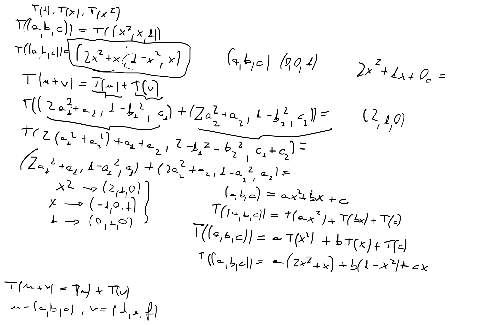

##### Operações

- Rotacionar vetor no plano
- Rotacionar vetor no espaço
- Produto misto entre vetores

Obter matriz da transformação linear.

Álgebra linear distanciando da álgebra e adotando matrizes.

##### Exemplo 1

Dada uma transformação linear, "tirar a álgebra" da transformação. Obter a matriz da transformação linear.

Exemplo: rotação. Quadrantes. Levar o vetor $(2,3)$ do primeiro ao quarto quadrante. Do primeiro ao quarto quadrante, $x$ é preservado e $y$ é multiplicado por $-1$.

Matriz de entrada: $\begin{bmatrix}2\\3\end{bmatrix}$, base canônica $R^2$: $\begin{bmatrix}1&0\\0&1\end{bmatrix}$

---

#### Exercícios p. 127

1. Se $T:V\rightarrow W$, $v\in V$ e $w\in W$, encontre o domínio $V$ e o contradomínio $W$ da transformação definida pelas equações e determine se $T$ é linear.

$\begin{cases}
w_1=x+2y\\
w_2=-y\\
w_3=x+y
\end{cases}$

2. Considere a transformação linear $T:\mathbb{R^3}\rightarrow\mathbb{R^3}$ definida por $T(x,y,z)=(-5x+z,y+z,3x+y)$. Utilize os vetores $u=(1,-1,3)$ e $v=(0,4,-3)$ para mostrar que $T(2u-v)=2T(u)-3T(v)$.

3. Verifique quais das seguintes funções são transformações lineares:

   1. $T_1:\mathbb{R^3}\rightarrow\mathbb{R^3},T_1(x,y,z)=(2x-1,2z-x)$
   2. $T_2:\mathbb{R^2}\rightarrow\mathbb{R^2},T_2(x,y)=(5x,y^2)$
   3. $T_3:\mathbb{R^2}\rightarrow\mathbb{R^3},T_3(x,y)=(x+y,x-y,0)$

   Verificar os dois axiomas: $T(\vec{u}+\vec{v})=T(\vec{u}+\vec{v})$ e $T(\alpha \vec{v})=\alpha T(\vec{v})$. ($\alpha$ é escalar.)

4. Dada $T:\mathbb{R^2}\rightarrow\mathbb{R^2}$, represente geometricamente um vetor genérico $v=(x,y)\in V$ se $T(x,y)=(-3x,2y)$.

5. Dados os seguintes operadores lineares, determine a matriz canônica $[T]$ de suas transformações lineares:
   1. $T_1(x,y)=(x-2y,x+y)$
   2. $T_2(x,y,z)=(x-y-2z,-x+2y+z,x-3z)$

6. Dada a matriz canônica $T=\begin{bmatrix}-1&2&0\\3&1&5\end{bmatrix}$  de uma transformação linear, use-a para obter $T(-1,1,3)$.

7. Determine a transformação linear $T:\mathbb{R^2}\rightarrow\mathbb{R^3}$ sabendo que $T(-1,1)=(3,2,1)$ e $T(0,1)=(1,1,0)$.

8. Se $T:\mathbb{R^3}\rightarrow\mathbb{R^2}$ tal que $T(3,2,1)=(1,1)$, $T(0,1,0)=(0,-2)$ e $T(0,0,1)=(0,0)$, determine:
   1. $T(x,y)$
   2. $v\in V$ tal que $T(v)=(1,1)$
   3. $v\in V$ tal que $T(v)=(0,0)$
      1. Transformação linear injetora, leva ao vetor $0$.

9. Seja $P_2$ o espaço vetorial dos polinômios de ordem 2 $ax^2+bx+c$. Se representamos qualquer elemento $u$ deste espaço como $u=(a,b,c)$, determine se $T:P_2\rightarrow P_2$ tal que $T(1)=x$, $T(x)=1-x^2$ e $T(x^2)=x+2x^2$ é transformação linear.

---