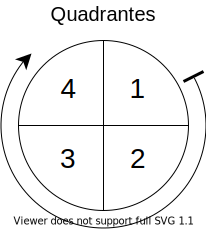

##### Espaço vetorial

Alguns espaços vetoriais diferentes são espaços vetoriais de *dimensões* diferentes.

Exemplos de espaços vetoriais:

- $\large{\mathbb{R}^2}$ (por dimensão)
- $\large{\mathbb{R}^3}$ (por dimensão)
- Matrizes de ordem (tamanho) $\large{m\times n}$
- Polinômios de grau $\large{n}$

Os elementos dos espaços vetoriais são somente os vetores.

Os escalares são definidos como parte da operação de multiplicação por um escalar.

Os elementos de um espaço escalar, embora sejam referidos geralmente por *vetores*, podem, como os exemplos acima indicam, ser objetos de diversos tipos.

$\large{0}$ e $\large{1}$ em um espaço vetorial podem se referir aos vetores nulo e unitário ($\large{0, 0, ...)}$ e $\large{(1, 1, ...)}$, ao invés dos números $\large{0}$ e $\large{1}$.

Base: menor conjunto de vetores linearmente independentes que gera o espaço vetorial ($\large{\beta}$).

$\large{\beta\text{ }\mathbb{R}^3\text{: }\left\{(1,0,0),(0,1,0),(0,0,1)\right\}}$

$\large{\beta\text{ }\mathbb{R}^4\text{: }\left\{(1,0,0,0),(0,1,0,0),(0,0,1,0),(0,0,0,1)\right\}}$

$\large{\beta\text{ }M(2,2)\text{: }\left\{
    \begin{bmatrix}1&0\\0&0\end{bmatrix},
    \begin{bmatrix}0&1\\0&0\end{bmatrix},
    \begin{bmatrix}0&0\\1&0\end{bmatrix},
    \begin{bmatrix}0&0\\0&1\end{bmatrix}
\right\}}$

##### Transformação linear

Função de um espaço vetorial para um espaço vetorial que satisfaz (condições para *teste* de um espaço vetorial):

- A transformação do vetor soma é a soma das transformações dos vetores
- A transformação do vetor multiplicação escalar é a multiplicação escalar da transformação do vetor

Uma transformação linear de/para o mesmo conjunto é um operador linear.

Uma função linear arbitrária é uma transformação linear apenas se passa pela origem $\large{(0,0)}$.

Escolher uma base para domínio e contradomínio de uma transformação linear restringe as matrizes que representam a transformação a uma única matriz. Esta matriz também corresponde unicamente ao operador.

Esta matriz permite o cálculo de vetores resultantes utilizando a multiplicação matricial: o resultado da transformação de um vetor é a multiplicação do vetor pela matriz da transformação.

A multiplicação vetorial é utilizada para calcular autovalores e autovetores.

Em uma transformação linear, podem haver vetores resultantes que são múltiplos dos vetores origem.

- Se um multiplicador $\large{\lambda}$ multiplica um vetor de origem e gera um vetor resultante, $\large{\lambda}$ é um autovalor da transformação.

- Se um vetor $\large{v}$ é multiplicado por um autovalor e gera um vetor resultante, $\large{v}$ é um autovetor da transformação.

Diagonalização: encontrar a base que resulta na matriz mais simples, ou matriz diagonal, de um operador.

Encontrando a matriz diagonalizada do operador:
- Os autovalores de uma matriz de operador $c$ são as raízes da equação característica da matriz
- Cada autovalor gera a partir de $\large{c}$ uma matriz $\large{v}$ que forma um sistema de equações $\large{v \times (x,y,...) = 0}$
- As soluções do sistema de equações são os autovetores referentes ao autovalor
- Os autovetores formam uma matriz $\large{p}$
- $\large{p}$ entra na fórmula $\large{c=p \times j \times p^{-1}}$, em que somente $\large{j}$ é desconhecida e é a matriz diagonalizada

Escalonamento: Encontrar os vetores mínimos ou mais simplificados em uma matriz, eliminando os linearmente dependentes (LD).

Determinante: Verificar se vetores em uma matriz são linearmente independentes (LI) ou não.

Matriz transformação de base para base. A redução de dimensão está em quais bases são escolhidas.

##### Axiomas da transformação linear

Se uma função em espaços vetoriais é uma transformação linear, então ela obedece aos axiomas das tranformações lineares.

Os axiomas são dois, um sobre a multiplicação por escalar, e outro sobre a adição.

1. $\large{\alpha T(\vec{v})=T(\alpha\vec{v})}$
2. $\large{T(\vec{v})+T(\vec{u})=T(\vec{v}+\vec{u})}$

